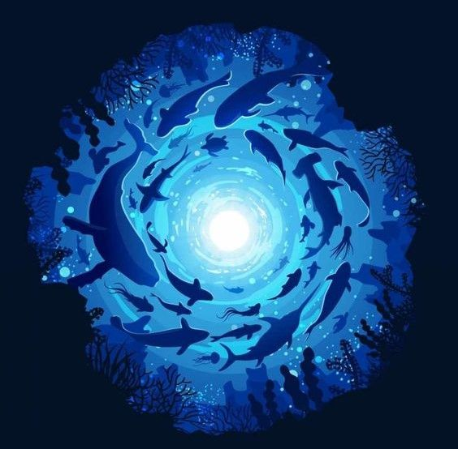

<!-- Profile Img ------------------------------------------------------------------------------------------------------------------ -->

<!-- Name Animation --------------------------------------------------------------------------------------------------------------- -->

  

<!-- About ----------------------------------------------------------------------------------------------------------------------- -->

  I am a passionate individual deeply immersed in the realm of technology, particularly in the dynamic field of front-end development. Constantly staying abreast of the latest trends, tools, and methodologies is not just a hobby for me; it's a way of life. With each new advancement, I eagerly delve into the intricacies of front-end development, exploring innovative frameworks, mastering cutting-edge languages, and honing my skills to craft seamless user experiences.

 

 <!-- Topics --------------------------------------------------------------------------------------------------------------------- -->
 ##
:large_blue_circle: Computer Engineering student
 
:large_blue_circle: Front-End
 
:large_blue_circle: Pronoums: he/him

<!-- Contact Section ----------------------------------------------------------------------------------------------------------------- -->
 ##
 <h3 align="center">Contact me:</h3>
 

  

<!-- Github Stats Section ------------------------------------------------------------------------------------------------------------- -->
##
<h3 align="center">Github stats:</h3>

<!-- Skills Section -------------------------------------------------------------------------------------------------------------- -->
##
<h3 align="center">My skills</h3>

#### Main Stack:
&nbsp;
&nbsp;
&nbsp;
&nbsp;
&nbsp;

#### Secondary Stack:
&nbsp;
&nbsp;
&nbsp;
&nbsp;
&nbsp;

#### Studying in this moment:
&nbsp;
&nbsp;
&nbsp;

#### Workstation Tools:
&nbsp;
&nbsp;
&nbsp;
&nbsp;
&nbsp;

<!-- Cobrinha de Commit ----------------------------------------------------------------------------------------------------------- -->
##
<picture>
  <source media="(prefers-color-scheme: dark)" srcset="https://raw.githubusercontent.com/viinii3/viinii3/output/github-contribution-grid-snake-dark.svg">
  <source media="(prefers-color-scheme: light)" srcset="https://raw.githubusercontent.com/viinii3/viinii3/output/github-contribution-grid-snake.svg">
  
</picture>
  

  
